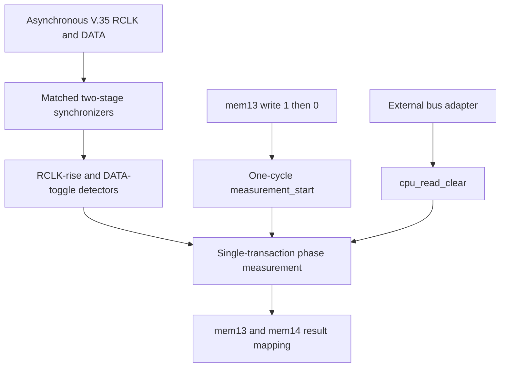

# Adaptive V.35 Sampling Monitor

[中文](README_zh-CN.md)

A SystemVerilog reconstruction of a legacy CPLD subsystem that measures the discrete phase between V.35 receive-clock edges and receive-data transitions. A CPU can use the result to select a safer sampling edge for a TDMoP device that has no built-in receive-edge adaptation.

## Current milestone

**Faithful version v1.0 is implemented and has passed the current unit and end-to-end simulations.**

“Faithful” means faithful to the behavior recovered from the legacy material and subsequently clarified with the original engineer. It does not mean mechanically reproducing every ambiguity in the old VHDL or Word document. In particular, the frozen RTL implements one CPU-controlled measurement transaction at a time; it does not implement the legacy document's CPU-side 10-sample or 3-sample averaging algorithm.

The extended version is not implemented yet. Timeout reporting, saturation handling, boundary classification, multiple-toggle detection, and broader regression remain future work.

## Why this exists

The original product used a TDMoP device that sampled V.35 receive data on a software-selected edge. At some operating frequencies, the DATA transition moved close to the default RCLK rising edge and caused bit errors. The legacy solution divided the work among three components:

| Component | Role |
|---|---|
| CPLD | Observe asynchronous RCLK and DATA, then report their discrete phase. |
| CPU | Interpret the result relative to the V.35 period and select a sampling edge. |
| TDMoP | Sample the actual traffic on the configured edge. |

This repository currently implements the CPLD measurement path and its CPU-facing register abstraction.

## Architecture



The measured quantity is a reference-clock sample-index difference:

$$
C_{phase}=n_d-n_r
$$

$$
t=C_{phase}\times20\text{ ns}
$$

where `n_r` is the most recent observable RCLK rising-event cycle and `n_d` is the first observable DATA-transition cycle that completes the transaction.

Key semantics:

- A CPU starts one measurement by writing `1` and then `0` to `mem13[3]` while the subsystem is idle.
- `register_interface` converts the accepted sequence into a single-cycle `measurement_start` pulse.
- Every RCLK rising event during the active window replaces the previous origin and clears the phase count.
- The first DATA transition after a valid origin captures the result.
- Events on adjacent 50 MHz cycles produce `phase_result=1`, equivalent to 20 ns.
- RCLK and DATA events observed on the same cycle produce `phase_result=0`.
- A newly accepted start immediately clears `result_valid`; the old numerical result may remain temporarily but is invalid.
- Writes while busy are rejected atomically.
- `cpu_read_clear` clears `result_valid` without erasing the stored result.
- The top level exposes `cpu_read_clear` because the real legacy CPU-bus read handshake is not yet known.

## Register mapping

| Field | Meaning |
|---|---|
| `mem13_rdata[3]` | CPU-visible control state |
| `mem13_rdata[2]` | Result valid/completion flag |
| `mem13_rdata[1:0]` | `phase_result[9:8]` |
| `mem14_rdata[7:0]` | `phase_result[7:0]` |

## Reset and initialization

Reset is synchronous to `clk_50m`. The faithful design has no `sync_valid` port. Each event detector uses its first post-reset sample to establish its comparison baseline.

If an asynchronous input is already high during reset, synchronizer filling can still appear as an internal event. The measurement core ignores events while idle, so this cannot publish a CPU-visible result. The first transaction must nevertheless start only after an initialization interval; the integrated testbench waits four 50 MHz cycles.

## Repository layout

```text
adaptive-sampling-monitor/
├── docs/
│   ├── original_v35_problem.md
│   ├── original_v35_problem_EN.md
│   ├── architecture.md
│   ├── architecture_en.md
│   ├── design_intent.md
│   ├── design_intent_en.md
│   ├── requirements.md
│   ├── requirements_en.md
│   ├── timing_behavior.md
│   ├── timing_behavior_en.md
│   ├── verification_plan.md
│   └── verification_plan_en.md
├── rtl/
│   ├── input_synchronizer.sv
│   ├── event_detector.sv
│   ├── phase_measurement.sv
│   ├── register_interface.sv
│   └── adaptive_sampling_monitor.sv
└── tb/
    ├── adaptive_sampling_monitor_tb.sv
    ├── testcases/
    └── unit/
        ├── input_synchronizer_tb.sv
        ├── event_detector_tb.sv
        ├── phase_measurement_tb.sv
        └── register_interface_tb.sv
```

`tb/testcases/` is reserved for future data-driven regression vectors. The current tests generate stimuli directly in SystemVerilog, so the folder is intentionally empty.

## Documentation

| Topic | Chinese | English |
|---|---|---|
| Historical problem record | [English](docs/original_v35_problem_EN.md) · [中文](docs/original_v35_problem.md) | The Chinese version remains the authoritative historical baseline. |
| Design intent | [design_intent.md](docs/design_intent_zh-CN.md) | [design_intent_en.md](docs/design_intent_EN.md) |
| Requirements | [requirements.md](docs/requirements_zh-CN.md) | [requirements_en.md](docs/requirements_EN.md) |
| Architecture | [architecture.md](docs/architecture_zh-CN.md) | [architecture_en.md](docs/architecture_EN.md) |
| Timing behavior | [timing_behavior.md](docs/timing_behavior_zh-CN.md) | [timing_behavior_en.md](docs/timing_behavior_EN.md) |
| Verification plan and results | [verification_plan.md](docs/verification_plan_zh-CN.md) | [verification_plan_en.md](docs/verification_plan_EN.md) |

## Build and run

Requirements:

- Verilator with SystemVerilog and `--timing` support
- GTKWave for interactive VCD inspection
- A C++ compiler and `make` available to Verilator

### End-to-end test

From the repository root:

```bash
verilator --binary \
  --timing \
  --trace \
  --top-module adaptive_sampling_monitor_tb \
  rtl/input_synchronizer.sv \
  rtl/event_detector.sv \
  rtl/phase_measurement.sv \
  rtl/register_interface.sv \
  rtl/adaptive_sampling_monitor.sv \
  tb/adaptive_sampling_monitor_tb.sv \
  --Mdir build/adaptive_sampling_monitor

./build/adaptive_sampling_monitor/Vadaptive_sampling_monitor_tb
echo $?
gtkwave adaptive_sampling_monitor_tb.vcd
```

Expected terminal result:

```text
PASS: adaptive_sampling_monitor completed 29 checks
0
```

`PASS` means every expectation encoded in that testbench was satisfied. Exit code `0` means the simulation process reported success to the operating system. Neither result alone proves that the specification is complete; waveform review and coverage analysis remain separate evidence.

### Unit-test pattern

Example for `phase_measurement`:

```bash
verilator --binary \
  --timing \
  --trace \
  --top-module phase_measurement_tb \
  rtl/phase_measurement.sv \
  tb/unit/phase_measurement_tb.sv \
  --Mdir build/phase_measurement

./build/phase_measurement/Vphase_measurement_tb
echo $?
gtkwave phase_measurement.vcd
```

Use the corresponding RTL and testbench files for the other unit tests.

## Verified results

| Testbench | Recorded result | Covered behavior |
|---|---|---|
| `input_synchronizer_tb.sv` | `PASS`, exit 0 | Reset, two-stage propagation, stable input, narrow inter-sample pulse |
| `event_detector_tb.sv` | `PASS`, 15 checks | Baseline establishment, rise/fall/toggle detection, one-cycle pulses |
| `phase_measurement_tb.sv` | `PASS`, 12 checks | Start, phases 1 and 3, origin replacement, same-cycle 0, read-clear, restart, reset |
| `register_interface_tb.sv` | `PASS`, 16 checks | Arm/start sequence, busy rejection, mapping, reset |
| `adaptive_sampling_monitor_tb.sv` | `PASS`, 29 checks, exit 0 | End-to-end phase 1 and phase 0 paths, busy rejection, read-clear, final reset |

Key waveforms have also been manually inspected.

## Known limits

[Established limits]

- The result is a discrete digital observation, not an exact analog phase measurement.
- Two-stage synchronization reduces metastability propagation risk but cannot eliminate metastability.
- Sub-cycle ordering is not preserved; same-sample events are deliberately reported as 0.
- Transitions folded between 50 MHz sample points may be missed.
- The faithful version has no timeout, saturation indication, or independent error register.
- No target-device synthesis, place-and-route, timing closure, board validation, or BER test has been completed in this repository.

[Not yet verified]

- Full regression at 64 kHz, 2.048 MHz, and all nominal `N=1..32` frequencies.
- Directed behavior near 10-bit counter wrap.
- Long missing-clock and missing-data cases.
- CPU-side `t/T` decision reference software.

## Extended-version roadmap

Candidate work, not current functionality:

1. Explicit missing-clock and missing-data timeouts.
2. Counter saturation and status reporting.
3. Boundary and multiple-toggle diagnostics.
4. Data-driven regression vectors under `tb/testcases/`.
5. Full nominal-frequency regression and an independent scoreboard.
6. Target-Lattice synthesis constraints, CDC attributes, and timing review.
7. Optional CPU reference model for the legacy `t/T` decision regions.

The extended version should be developed as a separate, clearly labeled layer so that improvements do not silently change the frozen faithful-version contract.
