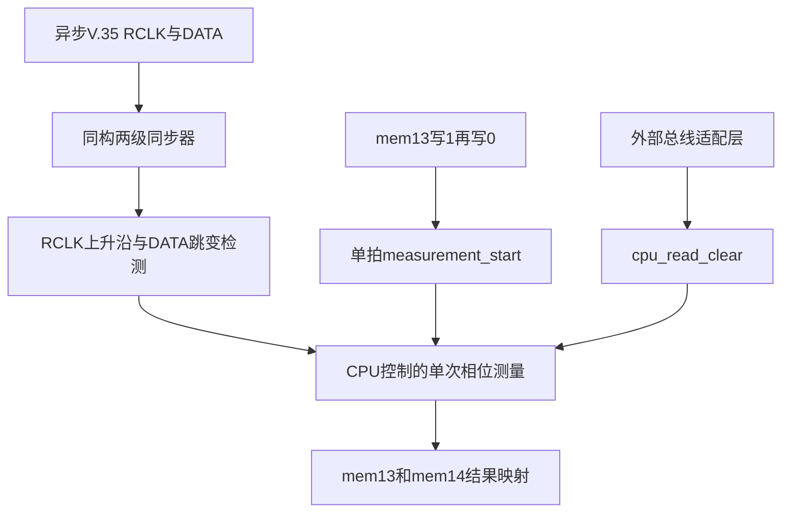

# V.35 接口自适应采样监测器

[English](README.md)

本项目用 SystemVerilog 重构一个历史 CPLD 子系统：离散测量 V.35 接收时钟上升沿与接收数据跳变之间的相位，并把结果提供给 CPU。CPU 可据此为不具备接收沿自适应能力的 TDMoP 芯片选择更安全的采样沿。

## 当前里程碑

**忠实版 v1.0 已完成 RTL，并通过当前模块级和系统级仿真。**

这里的“忠实版”是忠实于历史资料还原后、再经原工程师确认所冻结的工程行为，而不是机械复制旧 VHDL 或 Word 文档中的全部歧义。当前 RTL 实现 CPU 控制的单次测量事务，不在硬件中实现多样本统计；原 CPU 软件在上电或频率变化后对 10 个结果求平均，运行期以 1 s 为采样间隔、累计 3 个结果求平均后裁定。

CPU 参考模型探索已经完成并冻结：历史 10/3 样本算法、圆周统计候选、置信门、门限扫描和动态跟踪均已有可执行模型。该软件探索不修改 CPLD v1.0。硬件拓展版仍未实现；超时、计数饱和、边界分类、多次跳变诊断和更广泛的 RTL 回归仍属于后续工作。

## 问题背景

原设备的 TDMoP 芯片只能由软件选择固定采样沿。在部分 V.35 工作频率下，数据跳变靠近默认的接收时钟上升沿，导致误码。原方案的职责划分为：

| 组成 | 职责 |
|---|---|
| CPLD | 旁路观察异步 RCLK 与 DATA，并报告离散相位。 |
| CPU | 重复发起单次测量，完成 10 样本首次平均或 3 样本持续平均，再按当前 V.35 周期选择或保持采样沿。 |
| TDMoP | 使用配置后的边沿真正采样业务数据。 |

本仓库当前实现 CPLD 测量链和面向 CPU 的寄存器抽象。

## 架构与核心语义



测量值是两个 50 MHz 观测事件的拍号差：

$$
C_{\mathrm{phase}} = n_d - n_r
$$

$$
t = C_{\mathrm{phase}} \times 20\text{ ns}
$$

- CPU 在空闲时向 `mem13[3]` 写 1、再写 0，发起一次测量。
- 寄存器接口把接受的序列转换为一个 50 MHz 周期的 `measurement_start`。
- 检测窗口内每个 RCLK 上升沿都替换旧原点并清零计数。
- 有效原点后的第一次 DATA 跳变锁存结果。
- 相邻两个 50 MHz 拍观测到事件时结果为 1，即 20 ns。
- 同拍观测到 RCLK 与 DATA 事件时结果为 0。
- 接受新启动时立即清除 `result_valid`；旧数值可暂存，但已经无效。
- 忙时控制写入整体拒绝，不改变控制位或内部武装状态。
- `cpu_read_clear` 只清除有效位，不清除已保存的数值。
- 由于真实 CPU 总线读握手尚未知，顶层直接暴露 `cpu_read_clear`，不虚构总线协议。

## 寄存器映射

| 字段 | 含义 |
|---|---|
| `mem13_rdata[3]` | CPU 可见控制状态 |
| `mem13_rdata[2]` | 结果有效/完成标志 |
| `mem13_rdata[1:0]` | `phase_result[9:8]` |
| `mem14_rdata[7:0]` | `phase_result[7:0]` |

## 复位与初始化

复位是 `clk_50m` 域同步复位。忠实版没有 `sync_valid` 端口；每个事件检测器用复位后的第一个样本建立比较基线。

如果异步输入在复位期间已经为高电平，同步链填充仍可能表现为一次内部事件。测量核心在空闲时忽略事件，因此不会发布 CPU 可见结果；但首次事务仍必须等待初始化。当前系统级 TB 在启动前等待 4 个 50 MHz 周期。

## 目录结构

```text
adaptive-sampling-monitor/
├── README.md
├── README_zh-CN.md
├── docs/
│   ├── original_v35_problem.md
│   ├── original_v35_problem_EN.md
│   ├── architecture_zh-CN.md
│   ├── architecture_EN.md
│   ├── design_intent_zh-CN.md
│   ├── design_intent_EN.md
│   ├── requirements_zh-CN.md
│   ├── requirements_EN.md
│   ├── timing_behavior_zh-CN.md
│   ├── timing_behavior_EN.md
│   ├── verification_plan_zh-CN.md
│   ├── verification_plan_EN.md
│   ├── cpu_algorithm_exploration_zh-CN.md
│   └── cpu_algorithm_exploration_EN.md
├── model/
│   ├── cpu_model_spec.md
│   ├── cpu_sampling_decision.py
│   ├── compare_decision_algorithms.py
│   ├── scan_decision_thresholds.py
│   ├── simulate_guarded_controller.py
│   └── simulate_dynamic_tracking.py
├── rtl/
│   ├── input_synchronizer.sv
│   ├── event_detector.sv
│   ├── phase_measurement.sv
│   ├── register_interface.sv
│   └── adaptive_sampling_monitor.sv
└── tb/
    ├── adaptive_sampling_monitor_tb.sv
    ├── testcases/        # 预留给未来的数据驱动测试向量
    └── unit/
        ├── input_synchronizer_tb.sv
        ├── event_detector_tb.sv
        ├── phase_measurement_tb.sv
        └── register_interface_tb.sv
```

当前测试激励直接写在 SystemVerilog TB 中，因此 `tb/testcases/` 为空是有意保留的扩展位置。

## 文档索引

| 主题 | 中文 | 英文 |
|---|---|---|
| 历史问题记录 | [original_v35_problem.md](docs/original_v35_problem.md) | [original_v35_problem_EN.md](docs/original_v35_problem_EN.md) |
| 设计意图 | [design_intent_zh-CN.md](docs/design_intent_zh-CN.md) | [design_intent_EN.md](docs/design_intent_EN.md) |
| 需求规格 | [requirements_zh-CN.md](docs/requirements_zh-CN.md) | [requirements_EN.md](docs/requirements_EN.md) |
| 架构设计 | [architecture_zh-CN.md](docs/architecture_zh-CN.md) | [architecture_EN.md](docs/architecture_EN.md) |
| 时序行为 | [timing_behavior_zh-CN.md](docs/timing_behavior_zh-CN.md) | [timing_behavior_EN.md](docs/timing_behavior_EN.md) |
| 验证计划与结果 | [verification_plan_zh-CN.md](docs/verification_plan_zh-CN.md) | [verification_plan_EN.md](docs/verification_plan_EN.md) |
| CPU 算法探索 | [cpu_algorithm_exploration_zh-CN.md](docs/cpu_algorithm_exploration_zh-CN.md) | [cpu_algorithm_exploration_EN.md](docs/cpu_algorithm_exploration_EN.md) |

## 编译与运行

需要 Verilator、GTKWave，以及 Verilator 可调用的 C++ 编译器和 `make`。

在仓库根目录运行系统级测试：

```bash
verilator --binary \
  --timing \
  --trace \
  --top-module adaptive_sampling_monitor_tb \
  rtl/input_synchronizer.sv \
  rtl/event_detector.sv \
  rtl/phase_measurement.sv \
  rtl/register_interface.sv \
  rtl/adaptive_sampling_monitor.sv \
  tb/adaptive_sampling_monitor_tb.sv \
  --Mdir build/adaptive_sampling_monitor

./build/adaptive_sampling_monitor/Vadaptive_sampling_monitor_tb
echo $?
gtkwave adaptive_sampling_monitor_tb.vcd
```

测试成功时，测试平台会输出 `PASS` 摘要，shell 会输出退出码 `0`。

`PASS` 表示 TB 中实际执行的检查都满足了写入 TB 的预期；`echo $? = 0` 表示仿真进程向操作系统报告成功退出。二者都不能单独证明规格完整或全部输入已经覆盖，仍需结合波形核对和覆盖分析。

## 当前验证结果

| 测试平台 | 实际结果 | 已覆盖行为 |
|---|---|---|
| `input_synchronizer_tb.sv` | `PASS`，退出码 0 | 复位、两级传播、稳定输入、采样点间窄脉冲 |
| `event_detector_tb.sv` | `PASS` | 首样本基线、上升/下降/跳变、单拍输出 |
| `phase_measurement_tb.sv` | `PASS` | 启动、相位1和3、最近原点、同拍0、读清、重启、复位 |
| `register_interface_tb.sv` | `PASS` | 写1武装、写0启动、忙时拒绝、映射、复位 |
| `adaptive_sampling_monitor_tb.sv` | `PASS`，退出码 0 | 相位1和0的完整链路、忙时拒绝、读清、最终复位 |

关键波形已经人工核对。

## 已知边界

[已确定]

- 结果是离散数字观测量，不是精确模拟相位。
- 两级同步只能降低亚稳态传播概率，不能消除亚稳态。
- 20 ns 内的真实事件先后无法保留；同拍事件按工程裁决记 0。
- 两个采样点之间被折叠的跳变可能漏检。
- 忠实版没有超时、饱和标志或独立错误寄存器。
- 尚未完成目标器件综合、布局布线、时序收敛、板级验证或误码率测试。

[尚未验证]

- 64 kHz、2.048 MHz 和 $N = 1,\ldots,32$ 全频点回归。
- 接近 10 位计数回绕的定向测试。
- 长期无时钟、长期无数据跳变压力测试。
- 使用真实板上连续相位日志验证 CPU 参考模型，并据产品要求确定候选门限。

## 拓展版路线图

以下只是候选方向，不是现有功能：

1. 无时钟和无数据跳变超时。
2. 计数饱和与状态上报。
3. 边界与多次跳变诊断。
4. 在 `tb/testcases/` 中加入数据驱动回归向量。
5. 全频点回归与独立记分板。
6. 目标 Lattice 器件约束、CDC 属性和时序审查。
7. 获得真实相位日志或产品时延要求后，重新评估候选 CPU 门限与失败恢复策略。

拓展版应作为明确分层的新版本开发，不能让增强功能悄然改变已冻结的忠实版契约。
