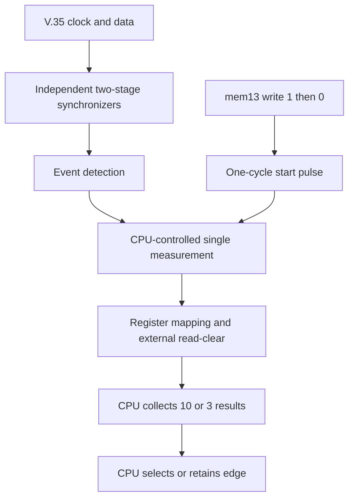

# V.35 Phase-Measurement Subsystem — Architecture

Document revision: v1.2
RTL baseline: v1.0 (this documentation correction does not modify RTL)
Status: Faithful-version RTL implemented and verified within the current scope
Date: 2026-08-20

## 1. Purpose

This document defines the structural boundary after the V.35 receive clock and data enter the 50 MHz reference-clock domain, and separates the responsibilities of the CPLD, CPU, and TDMoP device.

In v1.0, the CPU starts one measurement by writing `1` and then `0` to `mem13[3]`. `register_interface` converts the accepted sequence into a one-cycle `measurement_start` pulse. The measurement core invalidates the previous completion state immediately, continuously replaces the most recent RCLK origin while the transaction is active, captures the first observable data transition, and publishes a 10-bit result. Adjacent reference-clock samples produce a result of 1, or 20 ns. The external bus adapter supplies `cpu_read_clear` after a valid CPU read.

## 2. System roles

| Component | Responsibility |
|---|---|
| TDMoP | Receives the actual V.35 traffic and samples it on the selected edge. |
| CPLD | Passively observes `v35_rclk` and `v35_data`, measures their discrete phase in the 50 MHz domain, and exposes the result to the CPU. |
| CPU | Repeats single measurements, forms the 10-sample initial or 3-sample periodic statistic, interprets it using the legacy $t/T$ regions, and configures the sampling edge. |

One readable result is one input sample to the software decision. The faithful v1.0 RTL does not average multiple measurements.

## 3. Clock domains and input paths

| Signal | Role | Drives functional registers directly? |
|---|---|---|
| `clk_50m` | Only internal functional clock; 20 ns period | Yes |
| `v35_rclk` / `rclk_async` | Observed asynchronous receive clock | No |
| `v35_data` / `data_async` | Observed asynchronous receive data | No |

Each asynchronous input uses an independent but identical path:

```text
asynchronous input -> synchronizer stage 1 -> synchronizer stage 2 -> history register
```

Only the second synchronizer stage may feed ordinary logic. The history register belongs to event detection and is not a third synchronizer stage. Both input paths use the same depth, reset behavior, and approximately matching logic so that the implementation does not deliberately skew the measured relationship.

## 4. Event detection

```systemverilog
rclk_rise_evt   = rst_n && detector_armed &&  rclk_sync && !rclk_sync_d;
data_toggle_evt = rst_n && detector_armed && (data_sync != data_sync_d);
```

- RCLK reports rising edges only.
- DATA reports transitions of either polarity.
- Each event is a one-cycle pulse in the 50 MHz domain.
- Events represent discrete observations; they do not preserve continuous-time ordering within a 20 ns sample interval.

## 5. Subsystem structure



| Block | Primary responsibility |
|---|---|
| `input_synchronizer` | Reduces the probability that metastability propagates into functional logic. |
| `event_detector` | Produces RCLK-rise and DATA-toggle pulses. |
| `phase_measurement` | Maintains the latest RCLK origin and captures one phase result. |
| `register_interface` | Accepts the `mem13[3]` write sequence, rejects writes while busy, emits `measurement_start`, and maps the result. |
| External bus adapter | Produces `cpu_read_clear` from a real read transaction; its protocol is deliberately outside this RTL. |

## 6. Measurement transaction

1. While idle, the CPU writes `1` and then `0` to `mem13[3]`.
2. The interface emits a one-cycle `measurement_start`; the core becomes busy and clears `result_valid`.
3. Every observed RCLK rising edge becomes the new origin and resets the phase count.
4. If no DATA transition occurs, later RCLK rising edges replace the old origin.
5. The first observable DATA transition captures the count and sets `result_valid`.
6. The CPU reads the result; the bus adapter pulses `cpu_read_clear`.
7. A new accepted start invalidates an unread old result immediately. The old numerical value may remain temporarily but is no longer valid.

Writes during `measurement_busy=1` are rejected atomically: neither the visible control bit nor the internal armed state changes. An accepted write of 1 arms one start; the first accepted write of 0 consumes it. Additional zeros do not retrigger.

## 7. Count and same-cycle semantics

For an origin observed on cycle `n_r` and a DATA transition observed on cycle `n_d`:

$$
C_{\mathrm{phase}} = n_d - n_r
$$

$$
t = C_{\mathrm{phase}} \times 20\text{ ns}
$$

| Event combination | Behavior |
|---|---|
| RCLK only | Establish a new origin and clear the counter. |
| DATA only with a valid origin | Capture the current count. |
| RCLK and DATA in the same cycle | Use the current RCLK as origin and capture 0. |
| Neither, with a valid origin | Increment the count. |

The same-cycle result is explicitly 0. It is not an accidental consequence of nonblocking-assignment ordering.

## 8. Result mapping and read-clear

- `mem13_rdata[3]`: control state.
- `mem13_rdata[2]`: `result_valid`.
- `mem13_rdata[1:0]`: `phase_result[9:8]`.
- `mem14_rdata[7:0]`: `phase_result[7:0]`.
- `cpu_read_clear` clears only `result_valid`; it does not erase the stored numerical result.
- A newly captured result has priority if capture and read-clear occur unexpectedly in the same cycle.

## 9. Reset and initialization

Reset is synchronous to `clk_50m`. It clears synchronizer stages, event history, measurement state, counter, result, and valid state. The faithful version has no `sync_valid` interface. Each event detector uses its first post-reset sample to establish its history baseline.

If an asynchronous input is already high during reset, synchronizer filling can still create an internal transition. This cannot become a CPU-visible result while the measurement core is idle. Software must nevertheless allow initialization time before the first start; the system testbench waits four `clk_50m` cycles.

## 10. Faithful-version boundary

The v1.0 faithful version intentionally has no:

- missing-clock timeout;
- missing-data timeout;
- counter-saturation report;
- `boundary_flag`;
- `multiple_toggle` indication;
- autonomous CPLD edge selection.

These belong to a future extended version and must not be presented as current behavior.

## 11. Implementation and verification status

The two synchronizers, event detectors, phase core, register interface, and integrated top level are implemented. Four unit testbenches and one end-to-end testbench have printed `PASS`; the integrated test completed 29 checks with process exit code 0, and key waveforms were manually inspected.

This evidence shows conformance to the encoded v1.0 specification and covered scenarios. It does not prove analog metastability behavior, board-level timing margin, bit-error rate, or correctness for every untested input.

## 12. Open items

1. Exact target Lattice device and recommended synchronizer attributes.
2. Legacy register addresses and bus timing.
3. Final CPU-to-TDMoP control path.
4. Minimum valid input high/low time and minimum observable transition spacing.
5. How the CPU detects a frequency change and re-enters the 10-sample initial calibration.
6. Whether the first periodic sample is taken immediately after initialization or after the first 1 s interval.

## 13. CPU reference enhancement architecture

The CPU reference model adds a pure-software layer after the existing CPLD register interface. It repeatedly reads single results, performs circular statistics, checks circular concentration and normalized decision margin, and then chooses among configure, retain, or retry actions. This layer adds no CPLD state and does not change `phase_result`, `result_valid`, or the read-clear protocol.

The legacy arithmetic mean and the candidate enhancement are retained side by side for regression comparison. The current schedule reconstruction uses 10 valid samples after power-up or a frequency change, followed by one result approximately every second and non-overlapping batches of three for periodic decisions. Because the source did not explicitly define batching, this is an implementation decision rather than a recovered historical fact.

The exploratory gate uses concentration at least `0.9` and normalized circular margin at least `0.025`. These values are scenario-study parameters, not product requirements. The architectural conclusion is that the existing interface is sufficient for algorithm exploration, not that the candidate algorithm has become the product implementation.
