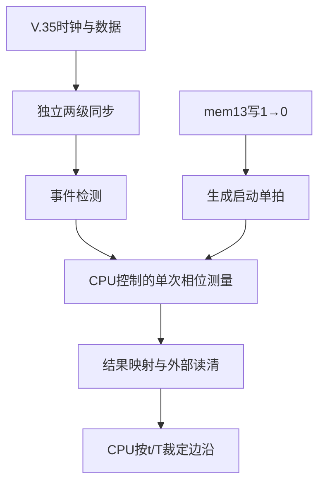

# V.35 相位测量子系统——架构设计

版本：v1.0
状态：忠实版 RTL 已实现并通过当前验证
日期：2026-08-07

## 1. 文档目的

本文定义 V.35 接收时钟与接收数据进入 50 MHz 参考时钟域后的结构边界，以及 CPLD、CPU 与 TDMoP 的职责关系。

v1.0 同步已完成的忠实版 RTL：CPU 通过 `mem13[3]` 的受控写 `1→0` 序列发起测量，`register_interface` 将其转换为一个 50 MHz 周期的内部 `measurement_start`；测量核心接受启动后立即清除旧结束标志。相邻两个 50 MHz 采样拍分别检测到时钟与数据事件时，结果为 1，对应 20 ns。CPLD 在检测窗口内跨接收时钟周期更新最近原点，捕获第一次可观测数据跳变并置结束标志；CPU 看到结束标志后读取，外部总线适配层通过 `cpu_read_clear` 清除该标志。

## 2. 系统角色

| 组成 | 职责 |
|---|---|
| TDMoP | 实际接收 V.35 业务数据，并按选定边沿采样。 |
| CPLD | 旁路观察 `v35_rclk` 与 `v35_data`，在 50 MHz 域测量离散相位并向 CPU 提供结果。 |
| CPU | 读取 CPLD 的相位结果，按原文档中的 `t/T` 区间逐周期裁定采样边沿，并配置相应控制。 |

CPU 不对若干次测量求平均；一次可读结果就是一次裁定输入。

## 3. 时钟域与输入路径

| 信号 | 角色 | 是否驱动内部寄存器 |
|---|---|---|
| `clk_50m` | 唯一内部工作时钟，周期 20 ns | 是 |
| `v35_rclk` | 被观察的异步接收时钟 | 否 |
| `v35_data` | 被观察的异步接收数据 | 否 |

两路异步输入各自采用独立但同构的路径：

```text
异步输入 -> 第一级同步寄存器 -> 第二级同步寄存器 -> 历史样本寄存器
```

只允许第二级同步输出进入普通逻辑。历史样本寄存器用于事件检测，不是第三级同步器。两路应保持相同的同步级数、复位策略和近似逻辑路径，以减少设计人为引入的相对偏移。

## 4. 事件检测

```systemverilog
rclk_rise_evt   = rst_n && detector_armed &&  rclk_sync && !rclk_sync_d;
data_toggle_evt = rst_n && detector_armed && (data_sync != data_sync_d);
```

- 接收时钟只检测上升沿；
- 数据检测任意极性翻转；
- 两个事件均为 50 MHz 域内的单拍脉冲；
- 它们表示离散观测事件，不表示 20 ns 内的连续时间先后。

## 5. 子系统分层



| 结构 | 核心职责 |
|---|---|
| 同步器 | 降低异步输入亚稳态向功能逻辑传播的概率。 |
| 事件检测器 | 生成 `rclk_rise_evt` 与 `data_toggle_evt`。 |
| 相位测量核心 | 接收 CPU 启动事件，并在检测窗口内维护最近接收时钟原点和相位计数。 |
| 结果寄存器 | 锁存一次相位结果；未重新启动时保持到 CPU 读清。 |
| 寄存器接口 | 接受 `mem13[3]` 写 `1→0`，生成单拍启动；连续映射 `mem13_rdata` 与 `mem14_rdata`。 |
| 外部总线适配边界 | 根据真实 CPU 读事务产生 `cpu_read_clear`；当前顶层不假设未知总线握手。 |

## 6. CPU 控制的检测模型

兼容基线采用 CPU 控制的单次检测事务：

1. CPU 在测量空闲时依次向 `mem13[3]` 写 1、写 0；寄存器接口生成持续一个 50 MHz 周期的 `measurement_start`，开启检测窗口并立即清除旧 `result_valid`；
2. 检测到任一 `rclk_rise_evt` 时，把它作为新周期原点并把相位计数清零；
3. 若本周期尚未检测到数据翻转，则随后每个 50 MHz 拍递增计数；
4. 若连续若干接收时钟周期没有数据翻转，则每个新 `rclk_rise_evt` 都放弃旧原点并重新清零；
5. 检测到第一次 `data_toggle_evt` 时，锁存当前相位计数并置 `result_valid`；
6. CPU 观察到结束标志后读取结果，读取动作同时清除 `result_valid`；
7. CPU 可再次发出 `start`，不需要对多次结果做平均；若旧结果未读，新事务开始时先使旧结果无效，新结果完成后再覆盖旧数值并重新置位 `result_valid`。

状态机可以用 `Idle`、`WaitRclk`、`WaitData` 和 `ResultValid` 表达这些行为。这里的“逐周期更新”仅发生在已启动但尚未完成的检测窗口内。

控制写入在 `measurement_busy=1` 时被整体拒绝：既不改变 CPU 可见控制位，也不改变内部武装状态。一次已接受的写 1只武装一次启动；其后的第一个已接受写 0消耗该武装并产生一个启动单拍，继续写 0不会重复触发。

## 7. 计数与同拍语义

设原点事件拍号为 `n_r`，数据事件拍号为 `n_d`：

$$
C_{phase}=n_d-n_r
$$

$$
t=C_{phase}\times20\text{ ns}
$$

相邻拍结果为 1。同拍事件按已采用的工程裁决记 0：

| 事件组合 | 行为 |
|---|---|
| 仅 `rclk_rise_evt` | 清零并建立新原点。 |
| 仅 `data_toggle_evt`，已有原点 | 锁存当前计数。 |
| 两事件同拍 | 以本拍时钟事件作为原点，锁存结果 0。 |
| 两事件均无，已有原点且本周期尚未捕获 | 计数递增。 |

原工程师确认同拍不需要特殊异常处理，因此兼容基线不设置 `boundary_flag`。RTL 仍必须明确上述优先级，避免非阻塞赋值偶然锁存旧计数。

## 8. 结果保持与读清

- CPU 未再次启动检测时，结果值与 `result_valid` 在读取前保持稳定；
- `mem13_rdata[2]` 映射 `result_valid`，`mem13_rdata[1:0]` 映射结果高两位，`mem14_rdata[7:0]` 映射结果低八位；
- 当前顶层把 `cpu_read_clear` 暴露给外部总线适配层；有效读事务产生该单拍后，`result_valid` 清除；
- 读清不清除正在运行的周期原点和计数过程；
- 当旧结果尚未读清而 CPU 再次发出 `start` 时，接受 `start` 的时钟沿立即清除 `result_valid`；旧 `phase_result` 数值可暂存，但不再有效；新结果完成后覆盖旧数值并重新置位 `result_valid`；
- 正常 CPU 协议要求先观察结束标志再读取，因此读清与新结果捕获不会同拍；若异常同拍，新结果捕获优先。

## 9. 复位

原工程师确认复位为 50 MHz 域同步复位。兼容基线规定：

- 同步器各级、历史样本、测量状态、计数器、结果和有效位均使用同步复位；
- 同一路径各级复位值一致，基线为 0；
- 复位期间不报告事件或有效结果；
- 复位释放后，系统应至少留出同步链和历史样本完成填充的初始化时间，再允许 CPU 发起检测。

忠实版没有独立的 `sync_valid` 接口。同步器连续输出第二级采样；每个 `event_detector` 在复位释放后的第一个样本上用内部 `detector_armed` 建立历史基线，从后续相邻样本开始检测事件。若外部输入在复位期间已为高电平，同步链从复位值 0填充到 1时仍可能形成一次内部事件；只要 CPU 尚未启动测量，该事件会被测量核心忽略。当前系统级测试在复位释放后等待 4个 `clk_50m` 周期再启动首笔事务。

## 10. 异常与增强边界

原版本没有无时钟或无数据翻转超时，工程现场也未遇到这两类情况。因此：

- 兼容基线允许无接收时钟时持续等待；
- 接收时钟存在但数据长期不翻转时，仍在每个周期更新原点，不报告超时；
- 超时、计数饱和、`multiple_toggle` 与 `boundary_flag` 只属于增强版，不进入首版兼容接口。

## 11. v1.0 实现与验证状态

忠实版的同步器、事件检测器、相位测量核心、寄存器接口和系统顶层均已完成。四个模块级自检测试和系统级端到端测试均已实际运行并打印 `PASS`，仿真进程退出码为 0，关键波形已人工核对。该结论表示实现符合当前测试平台中编码的规格与场景，不等于证明所有板级条件、亚稳态行为或未覆盖输入均正确。

## 12. 仍待确认

1. 原目标 Lattice 器件型号及推荐同步器属性；
2. 原寄存器地址和总线时序；
3. 采样沿选择最终由 CPU 直接写 TDMoP，还是经 CPLD 输出控制；
4. 输入最小高低电平与最小有效跳变间隔。
