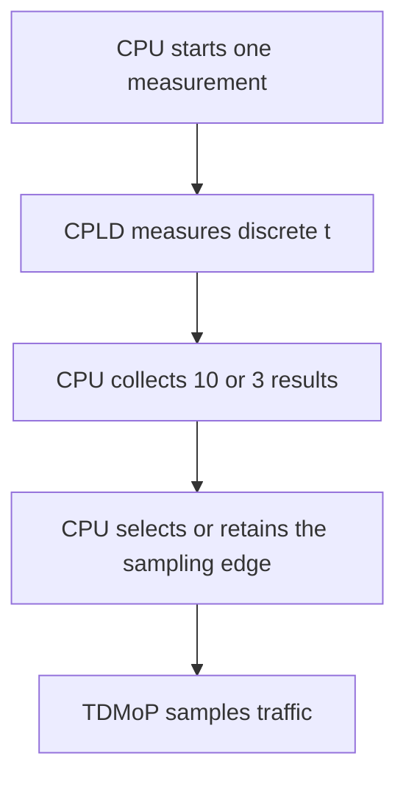

# V.35 Phase-Measurement Subsystem — Design Intent

Document revision: v1.2
RTL baseline: v1.0 (this documentation correction does not modify RTL)
Status: Faithful-version intent closed by RTL and tests
Date: 2026-08-20

## 1. Problem

The phase of V.35 receive-data transitions can leave insufficient margin at a fixed TDMoP sampling edge. The CPLD therefore measures the relative position of receive-clock and receive-data events with a 50 MHz reference clock. The CPU interprets the result using the legacy phase regions and selects the TDMoP sampling edge.

The CPLD does not receive the traffic on behalf of the TDMoP and does not autonomously choose the edge:

## 2. Frozen v1.0 decisions

- Each receive-clock rising edge inside an active transaction establishes a new origin.
- If DATA does not toggle for several receive-clock periods, every new RCLK edge still resets the phase count.
- The CPU reads individual results and forms the 10-sample or 3-sample statistic in software; the faithful RTL performs no multi-sample averaging.
- An accepted `mem13[3]` write `1 -> 0` sequence produces exactly one 50 MHz `measurement_start` pulse.
- Accepting a new start immediately clears the old valid state. A later result may overwrite an unread old numerical value.
- Adjacent reference-clock samples produce phase 1, equivalent to 20 ns.
- Same-cycle RCLK and DATA events produce phase 0 without an exception flag.
- Reset is synchronous.
- The legacy design has no missing-clock or missing-data timeout.
- Undefined gaps in the CPU's special-rate decision regions must be resolved consistently in software, but do not block the CPLD RTL.

## 3. Responsibility split

### CPLD

Synchronize both asynchronous inputs through identical two-stage paths; detect RCLK rising edges and DATA transitions; accept a one-cycle start; maintain the latest origin; capture the first DATA transition; publish a 10-bit result and valid state; reject control writes while busy; and clear the valid state when `cpu_read_clear` is asserted.

### CPU

Start transactions while idle, wait for each completion, read and clear each result, form the required 10-sample initial or 3-sample periodic statistic, apply the appropriate $t/T$ decision regions, and configure or retain the TDMoP sampling edge.

### TDMoP

Sample the actual V.35 data on the CPU-selected rising or falling edge.

## 4. What is measured

The result is a difference between two internally observable sample indices:

$$
C_{\mathrm{phase}} = n_d - n_r,\qquad t = C_{\mathrm{phase}} \times 20\text{ ns}
$$

It is not an exact continuous-time phase. Two-stage synchronization reduces metastability-propagation risk but cannot eliminate metastability, preserve sub-cycle ordering, or recover an even number of DATA transitions between reference-clock samples.

## 5. Transaction semantics

After synchronous reset, software must allow the synchronization paths and detector history to initialize; the current integrated test waits four cycles. The CPU then performs the accepted `1 -> 0` write sequence. During the active window, every RCLK event replaces the origin until the first DATA transition completes the transaction.

Busy writes are rejected as a whole. Repeated writes of 1 merely preserve the armed state; only the first accepted zero consumes that state and starts a measurement. The subsystem does not publish measurements without a start.

## 6. Same-cycle decision

When RCLK rise and DATA toggle are observed in one 50 MHz cycle, the implementation establishes the current cycle as the origin, captures 0, and sets no `boundary_flag`. This is a deterministic digital convention, not a claim about which analog edge occurred first.

## 7. CPU edge decision

### 7.1 Initial calibration

After power-up or a frequency change, software collects 10 valid phase results and computes their arithmetic mean `t`:

| Mean phase | Action |
|---|---|
| $0 < t < T/4$ | Select falling-edge sampling. |
| $T/4 < t < 3T/4$ | Select rising-edge sampling. |
| $3T/4 < t < T$ | Select falling-edge sampling. |

### 7.2 Periodic calibration

During operation, software obtains one result at approximately 1 s intervals. This project reconstructs three non-overlapping results as one decision batch:

| Mean phase | Action |
|---|---|
| $0 < t < T/12$ | Select falling-edge sampling. |
| $T/12 < t < 4T/12$ | Retain the current setting. |
| $`5T/12 < t < 7T/12`$ | Select rising-edge sampling. |
| $8T/12 < t < 11T/12$ | Retain the current setting. |
| $11T/12 < t < T$ | Select falling-edge sampling. |

### 7.3 Reconstruction decisions and open points

- The phrase “sample once every 1 s and average three samples” is reconstructed as a 1 s interval and non-overlapping three-sample batches.
- A three-point sliding window is not used because the source does not mention “the latest three” or sliding updates.
- The undocumented intervals $`4T/12 \le t \le 5T/12`$, $`7T/12 \le t \le 8T/12`$, and all exact thresholds retain the current setting in the executable reference model.
- Frequency-change detection and the start time of the first periodic sample remain unknown.

## 8. Result interface

The frozen mapping is:

| Field | Meaning |
|---|---|
| `mem13_rdata[3]` | CPU-visible control state |
| `mem13_rdata[2]` | `result_valid` |
| `mem13_rdata[1:0]` | `phase_result[9:8]` |
| `mem14_rdata[7:0]` | `phase_result[7:0]` |

Because the real bus read handshake is unknown, the top level exposes `cpu_read_clear` instead of inventing a bus protocol. Read-clear invalidates the result without erasing its numerical bits. A new captured result wins over an abnormal same-cycle read-clear.

## 9. Reset and excluded behavior

The faithful version has no `sync_valid`. Event detectors establish their history baseline internally. Synchronizer filling may create an internal event if an external input was high during reset, but no CPU-visible result can be generated while the phase core is idle. The first transaction must begin only after initialization time.

The faithful version excludes timeout, saturation reporting, `boundary_flag`, `multiple_toggle`, and independent error status. Those are possible extended-version features, not omissions to be silently added to v1.0.

## 10. Facts and open items

[Established facts]

- 50 MHz reference clock; V.35 range 64 kHz to 2.048 MHz.
- 10-bit phase result.
- Latest-origin replacement on every RCLK rise.
- CPU-controlled single transaction and read-clear.
- Adjacent samples yield 1; same-cycle events yield 0.
- Synchronous reset; no legacy timeout.

[Open]

1. Exact legacy bus timing and addresses in the final integration.
2. Target Lattice device and synchronizer attributes.
3. CPU-to-TDMoP control path.
4. Exact software policy for gaps in the special-rate regions.
5. Frequency-change detection and re-entry into initial calibration.

## 11. Completion statement

All four functional blocks and the top-level integration have self-checking tests. Covered paths include initialization wait, start, busy-write rejection, phase 1, same-cycle phase 0, register mapping, read-clear, restart semantics, and synchronous reset. The reported `PASS`, zero process exit code, and reviewed waveforms support compliance with the encoded faithful-version scope; they do not prove physical timing margin or all operating points.

## 12. CPU algorithm exploration decision

The legacy arithmetic mean remains the compatibility reference, but directed scenarios demonstrate that it can misinterpret samples clustered across the $0/T$ wrap. The candidate enhancement uses a circular mean and independently checks circular concentration and normalized distance to the nearest effective decision boundary.

If confidence is insufficient during initial calibration, the candidate publishes no new edge and requests another calibration attempt. During periodic calibration, it retains the current edge. The exploratory values concentration $\ge 0.9$ and circular margin divided by $T$ $\ge 0.025$ are comparison parameters only, not product requirements. See `cpu_algorithm_exploration_EN.md` for evidence, limitations, and resume conditions.
