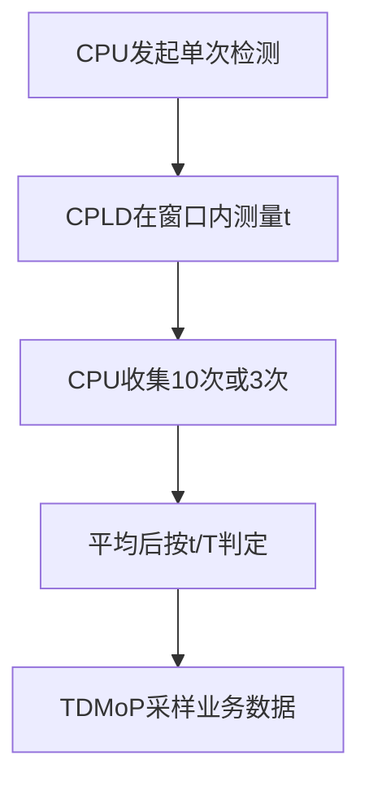

# V.35 相位测量子系统——设计意图

文档修订：v1.2
RTL 基线：v1.0（本次勘误不修改 RTL）
状态：忠实版设计意图已由 RTL 与测试闭环
日期：2026-08-20

## 1. 核心问题

V.35 接收数据的跳变位置可能使 TDMoP 的固定采样边沿缺少足够裕量。本系统让 CPLD 用 50 MHz 参考时钟离散测量接收时钟与数据跳变的相对位置，再由 CPU 依据原文档中的相位区间选择采样边沿。

本项目的核心不是用 CPLD 代替 TDMoP 接收业务数据，而是建立一条确定的测量与控制链：

## 2. v1.0 的冻结结论

经原设计工程师确认：

- 每个接收时钟周期都重新建立测量原点；
- 连续几个周期没有数据翻转时，每个新上升沿仍重新清零；
- CPLD 每次测量事务只产生一个可读相位结果，不在 RTL 内做多样本平均；
- CPU 在上电或频率变化后收集 10 个结果求平均，在运行期按 1 s 采样间隔累计 3 个结果求平均；
- CPU 读取结果后同时清除有效状态；
- CPU 通过 `mem13[3]` 写 `1→0` 发起检测，寄存器接口产生持续一个 50 MHz 周期的内部 `measurement_start`；
- 接受 `start` 时立即清除旧结束标志；若旧结果尚未读清，新结果完成时直接覆盖旧结果数值并重新置位结束标志；
- 相邻两个 50 MHz 采样拍分别检测到接收时钟上升沿与数据翻转时，结果为 1，对应 20 ns；
- 原版本没有无时钟或无数据翻转超时；
- 复位为同步复位；
- 同拍事件不需要额外异常语义，首版可记 0；
- 对特殊区间之间留下的空挡，原设计不要求唯一处理方式，可选取邻近的边沿或保持既有选择，只要实现前固定并一致验证。

因此，“单次测量”是 CPLD 的事务语义；“多次测量—求平均—区间判断”是 CPU 软件的系统策略，两者并不矛盾。

## 3. 职责划分

### 3.1 CPLD

1. 用独立同构的两级同步器接收 `v35_rclk` 与 `v35_data`；
2. 生成接收时钟上升沿和数据翻转事件；
3. 接收 CPU 持续一个 50 MHz 周期的检测启动脉冲；
4. 在检测窗口内的每个接收时钟上升沿清零相位计数；
5. 捕获随后第一次可观测数据翻转；
6. 锁存 10 位相位计数并置结束/有效状态；
7. 正常情况下保持结果到 CPU 读取；若 CPU 在未读清时重新启动检测，则启动拍立即清除旧结束标志，新结果完成后覆盖旧数值并重新置位；
8. 在 CPU 读取时清除结束/有效状态。
9. 在忙状态下整体拒绝控制写入，避免写入改变控制位或武装状态。

### 3.2 CPU

1. 在测量空闲时对 `mem13[3]` 执行写 1、写 0序列；
2. 等待检测结束标志；
3. 读取 CPLD 的相位计数，并由读取动作清除结束/有效状态；
4. 上电或频率变化后重复上述事务，收集 10 个有效结果并计算平均相位 `t`；
5. 按首次校准表选择上升沿或下降沿采样；
6. 运行期每隔 1 s 取得一个有效结果，以 3 个非重叠样本为一组计算平均相位；
7. 按持续校准表选择上升沿、下降沿或保持当前设置；
8. 对未定义区间和阈值等号采用预先固定的一致策略；
9. 配置 TDMoP 或相应控制寄存器。

### 3.3 TDMoP

按选定的上升沿或下降沿真正采样 V.35 业务数据并完成后续处理。

## 4. 测量对象

CPLD 测得的不是外部连续时间中的精确相位，而是两个内部离散事件之间的拍号差：

$$
C_{phase}=n_d-n_r
$$

$$
t=C_{phase}\times20\text{ ns}
$$

其中 `n_r` 是最近一次内部可观测 `rclk_rise_evt` 的拍号，`n_d` 是随后第一次内部可观测 `data_toggle_evt` 的拍号。

两级同步不能消除亚稳态，也不能保证保留 20 ns 内两个模拟边沿的真实先后。相邻采样点之间的偶数次翻转还可能被折叠或漏检。因此，`t` 是数字观测量，不是高精度模拟测量。

## 5. CPU 控制的检测行为

1. 同步复位后，至少等待同步链和事件历史完成填充；当前系统级测试采用 4个 `clk_50m` 周期；
2. CPU 对 `mem13[3]` 写 1后再写 0；寄存器接口生成一个 50 MHz 周期的内部启动单拍，开启检测窗口并立即清除旧结束标志；
3. 检测窗口内遇到接收时钟上升沿时，将计数清零并建立或更新原点；
4. 若本周期未出现数据翻转，新接收时钟上升沿直接替换旧原点；
5. 第一次数据翻转到来时锁存结果并置结束/有效标志；
6. CPU 观察到结束标志后读取结果，读取动作同时清除该标志；
7. CPU 可按需要再次发起检测。

忙状态下的 `mem13` 控制写被整体拒绝。重复写 1只保持武装，第一次已接受的写 0产生一次启动并消耗武装，继续写 0不会重复启动。

因此，忠实版是 CPU 控制的单次检测事务；“逐周期”描述的是一次检测窗口内可跨多个接收时钟周期持续更新最近原点，并不表示 CPLD 在没有 `start` 时不断发布结果。

## 6. 同拍裁决

当 `rclk_rise_evt` 与 `data_toggle_evt` 在同一个 50 MHz 拍出现时，兼容基线：

- 建立本拍新原点；
- 锁存相位结果 0；
- 不设置 `boundary_flag`；
- CPU 仍按既定相位区间作普通裁定。

原工程师认为不需要为真实事件的细微先后增加特殊逻辑，但 RTL 必须固定数值语义，测试平台也必须使用相同口径。

## 7. CPU 边沿裁定

CPU 对 CPLD 发布的单次结果进行软件统计，再用平均相位 `t` 执行两阶段裁定。

### 7.1 首次校准

上电或频率变化后收集 10 个有效结果并计算平均相位：

| 10 样本平均相位 | CPU 动作 |
|---|---|
| `0<t<T/4` | 设置下降沿采样 |
| `T/4<t<3T/4` | 设置上升沿采样 |
| `3T/4<t<T` | 设置下降沿采样 |

### 7.2 持续校准

运行期按 1 s 采样间隔取得结果，本项目默认每 3 个非重叠样本计算一次平均相位：

| 3 样本平均相位 | CPU 动作 |
|---|---|
| `0<t<T/12` | 设置下降沿采样 |
| `T/12<t<4T/12` | 保持当前设置 |
| `5T/12<t<7T/12` | 设置上升沿采样 |
| `8T/12<t<11T/12` | 保持当前设置 |
| `11T/12<t<T` | 设置下降沿采样 |

持续校准表中的“保持”区域是原方案已有的稳定机制，不应误述为每个单样本都直接切换。

### 7.3 重建裁决与未决项

- 原文“每 1 s 采样一次，采样 3 次求平均”按普通语义重建为 1 s 间隔、3 样本非重叠批次；
- 未采用 3 点滑动窗口，因为原资料未提及“最近 3 次”或滑动更新；
- 原资料未定义 `4T/12≤t≤5T/12`、`7T/12≤t≤8T/12` 及所有阈值等号的归属；
- 由于工程师确认这些模糊区间对原系统效果不敏感，参考软件默认将其归入“保持当前设置”；
- 频率变化的检测来源与第一个运行期样本的启动时点仍待确认。

## 8. 结果接口

兼容输出至少包括：

- 10 位相位计数；
- 结果有效或完成状态；
- CPU 读取触发的读清行为。

当前 RTL 已冻结的映射为：`mem13_rdata[3]` 是控制位，`mem13_rdata[2]` 是 `result_valid`，`mem13_rdata[1:0]` 是 `phase_result[9:8]`，`mem14_rdata` 是 `phase_result[7:0]`。由于原总线读握手尚未知，顶层直接暴露 `cpu_read_clear`，由未来外部总线适配层在有效读事务时产生；忠实版不虚构总线协议。

CPU 未读取且没有再次启动检测时，结果保持稳定。若 CPU 在旧结果未读清时再次启动检测，接受 `start` 的时钟沿立即令 `result_valid=0`；旧 `phase_result` 数值可以暂存，但此时无效。新检测完成后覆盖旧数值并重新令 `result_valid=1`。正常软件协议是等待结束标志后才读取，因此读清与新结果捕获不会同拍；为使 RTL 对异常输入仍有确定行为，若二者意外同拍，新结果捕获优先。

## 9. 复位与异常

复位采用 50 MHz 域同步复位。复位清除同步链、事件历史、测量状态、计数器、结果和有效位。复位释放后的同步填充变化不得生成 CPU 可见结果。

忠实版没有 `sync_valid`。两级同步器连续输出电平，事件检测器在复位释放后的第一个样本用内部 `detector_armed` 建立比较基线。若外部输入在复位期间已为高电平，填充过程仍可能形成一次内部事件，因此首笔测量不得在流水线稳定前启动；当前系统级基线等待 4拍。

原兼容版本不实现：

- 无接收时钟超时；
- 无数据翻转超时；
- `boundary_flag`；
- `multiple_toggle`；
- 独立错误状态。

这些可作为拓展版鲁棒性功能，但不得混入忠实版并改变其接口语义。

## 10. 当前假设与待确认

[已建立事实]

- 参考时钟为 50 MHz；
- V.35 频率范围为 64 kHz 至 2.048 MHz；
- 相位计数为 10 位；
- 每个接收时钟上升沿重新清零；
- CPU 逐结果读取并清除有效位，再在软件中形成 10 样本或 3 样本平均后裁定；
- CPU 用单拍 `start` 启动一次检测并等待结束标志；
- 接受新 `start` 时立即清除旧结束标志，随后产生的新结果可覆盖未读旧数值；
- 相邻采样拍的相位结果为 1，对应 20 ns；
- 同步复位；
- 原版无超时。

[仍待确认]

1. 原寄存器地址和总线读时序；
2. 目标 Lattice 器件型号与同步器属性；
3. CPU 最终配置 TDMoP 的具体控制路径；
4. CPU 如何检测频率变化并重新进入 10 样本校准。
5. 第一个运行期样本是初始校准完成后立即取得，还是先等待 1 s。

## 11. 忠实版完成状态

1. 两路同步器、事件检测器、相位测量核心和寄存器接口均已实现并通过模块级自检测试；
2. 顶层已完成四个子模块的集成，并通过系统级端到端自检测试；
3. 已验证复位后等待 4拍再启动条件下的启动、忙时写拒绝、相位 1、同拍相位 0、寄存器映射、读清和同步复位等关键路径；
4. 仿真输出 `PASS`、退出码为 0，且关键波形已经人工核对；
5. 当前结论仅说明 RTL 符合已编码的忠实版规格与测试范围，不证明真实亚稳态概率、板级时序裕量或全部频点。

## 12. CPU 算法探索裁决

历史普通平均保留为兼容参考，但已通过定向场景确认其不能正确处理 `0/T` 回绕。候选增强采用圆周平均，并分别检查圆周集中度和到有效决策边界的归一化裕量。

候选增强中，首次校准置信不足时不发布新采样沿并请求重测；运行期置信不足时保持当前沿。探索门限 `集中度≥0.9`、`圆周裕量/T≥0.025` 仅用于场景比较，不构成产品要求。完整证据和恢复条件见 `cpu_algorithm_exploration_zh-CN.md`。
