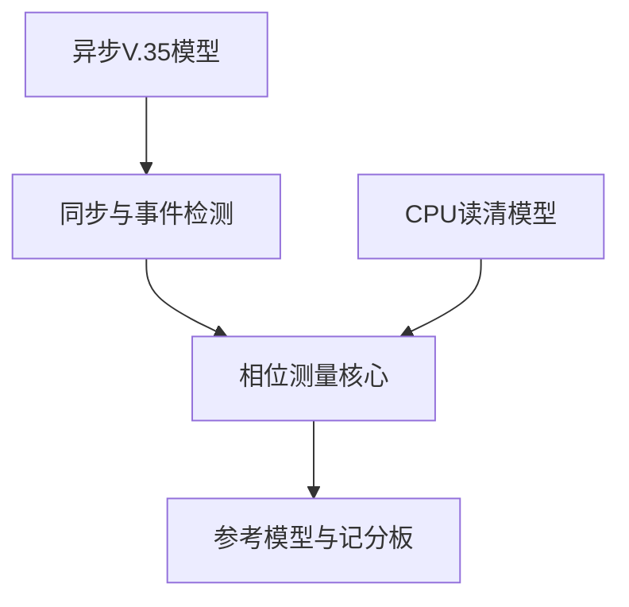

# V.35 相位测量子系统——验证计划

文档修订：v1.2
RTL 基线：v1.0（本次勘误不修改 RTL）
状态：忠实版模块级与系统级验证已完成
日期：2026-08-20

## 1. 验证目标

验证 V.35 异步输入经过同步与事件提取后，相位测量核心是否在 CPU 启动的检测窗口内逐周期建立原点、按确定计数口径锁存结果，并通过结束标志与读清接口稳定交付。

v1.0 以已完成 RTL 为准：CPU 通过 `mem13[3]` 写 `1→0`，寄存器接口生成单拍 `measurement_start`；启动时清除旧结束标志，CPU 等待新结束标志并由外部 `cpu_read_clear` 读清。每次 CPLD 事务只生成一个结果；CPU 的 10 样本首次平均、3 样本持续平均和区间裁定不进入 CPLD 核心 RTL。

## 2. 已冻结核心行为

- 50 MHz 是唯一内部工作时钟；
- 两路异步输入各自经过同构两级同步；
- 事件检测只使用第二级同步输出和历史样本；
- CPU 通过 `mem13[3]` 写 `1→0` 开启一次检测窗口，内部启动脉冲持续一个 50 MHz 周期；
- 忙时控制写入被整体拒绝，重复写 0不会重触发；
- 检测窗口内每个 `rclk_rise_evt` 都建立新周期原点并清零；
- 连续多个周期没有数据翻转时，每个周期仍重新建立原点；
- 第一次内部可观测 `data_toggle_evt` 锁存相位结果；
- 结果为 `C_phase=n_d-n_r`，相邻拍为 1，同拍为 0；
- CPU 读取清除 `result_valid`；
- CPU 未读清却再次启动时，接受 `start` 的时钟沿立即清除旧 `result_valid`，新结果完成后覆盖旧数值并重新置位；
- 正常协议下读清与新结果捕获不会同拍；异常同拍时新结果捕获优先；
- 复位为同步复位；
- 忠实版没有无时钟或无数据翻转超时；
- CPU 可重复启动和读取单次结果；首次校准收集 10 个结果求平均，运行期以 1 s 为间隔累计 3 个结果求平均。

## 3. 剩余待确认项

1. 原寄存器地址和总线读时序；
2. 目标器件型号及同步器属性；
3. CPU 如何检测频率变化并重新进入 10 样本校准。
4. 第一个运行期样本在初始校准后立即取得，还是先等待 1 s。

## 4. 验证分层

### 4.1 层级 A：相位测量核心

直接驱动：

- `rclk_rise_evt`；
- `data_toggle_evt`；
- `start`；
- `cpu_read_clear`；
- `sync_reset`。

该层精确控制事件拍号，验证计数、同拍、跨周期清零、结果保持和读清。

### 4.2 层级 B：同步器与事件检测

直接驱动异步 `v35_rclk` 与 `v35_data`，验证：

- 两级传播延迟；
- 复位后的流水线填充和基线建立；
- 接收时钟只生成上升沿事件；
- 数据上升和下降均生成翻转事件；
- 事件脉冲宽度为一拍；
- 稳定输入不产生伪事件。

数字仿真不证明真实亚稳态概率，只验证结构和离散可观测行为。

### 4.3 层级 C：子系统集成

使用异步 V.35 波形驱动完整子系统，验证同步延迟、事件顺序、相位结果以及 CPU 读清可见行为。

### 4.4 层级 D：寄存器接口

验证写 1武装、写 0单拍启动、重复写不重触发、忙时写入原子拒绝，以及 `mem13/mem14` 结果映射。`cpu_read_clear` 的真实总线产生逻辑不在本层内，因为原总线协议仍未确认。

## 5. 独立参考模型

参考模型保存最近一次时钟事件拍号 `n_r`。当数据事件到来时：

$$
C_{phase}=n_d-n_r
$$

- 同拍返回 0；
- 相邻拍返回 1；
- 新时钟事件会替换旧 `n_r`；
- 数据事件前没有有效 `n_r` 时不产生结果；
- 参考模型不得复制 DUT 的计数器更新代码。

## 6. 核心确定性测试

### 6.1 原点与计数

| 编号 | 场景 | 期望 |
|---|---|---|
| TC-PHASE-001 | 原点后一拍出现数据 | 结果为 1。 |
| TC-PHASE-002 | 原点后四拍出现数据 | 结果为 4。 |
| TC-PHASE-003 | 原点前出现数据 | 不产生有效结果。 |
| TC-PHASE-004 | 数据上升跳变 | 能终止本周期测量。 |
| TC-PHASE-005 | 数据下降跳变 | 能终止本周期测量。 |

### 6.2 周期更新

| 编号 | 场景 | 期望 |
|---|---|---|
| TC-CROSS-001 | 一个完整周期无数据翻转 | 下一时钟事件重新清零，不报错。 |
| TC-CROSS-002 | 多个周期无翻转后出现数据 | 相对最近原点锁存结果。 |
| TC-CROSS-003 | 长期有时钟但无数据 | 持续更新原点，不产生硬件超时。 |
| TC-CROSS-004 | 长期无时钟 | 保持等待，不产生硬件超时。 |

### 6.3 同拍与优先级

| 编号 | 场景 | 期望 |
|---|---|---|
| TC-SAME-001 | 尚无原点时两事件同拍 | 建立原点并锁存 0。 |
| TC-SAME-002 | 已有旧原点时两事件同拍 | 用本拍作为新原点并锁存 0，不使用旧计数。 |
| TC-SAME-003 | 同步复位与正常事件同拍 | 复位优先，不产生结果。 |
| TC-SAME-004 | 读清与新结果异常同拍 | 新结果捕获优先；拍后保留新结果且 `result_valid=1`。 |

### 6.4 结果保持与读清

| 编号 | 场景 | 期望 |
|---|---|---|
| TC-IF-001 | 结果产生后 CPU 暂不读取且不重启 | `phase_result` 与 `result_valid` 保持。 |
| TC-IF-002 | CPU 读取有效结果 | 拍后清除 `result_valid`。 |
| TC-IF-003 | 读清后产生下一结果 | 新结果可再次置位。 |
| TC-IF-004 | 结果未读时 CPU 再次启动 | 接受 `start` 后立即进入新检测并令 `result_valid=0`；旧结果数值暂存但无效；新检测完成时覆盖旧数值并令 `result_valid=1`。 |
| TC-IF-005 | 未收到 `start` 时出现输入事件 | 不发布新结果。 |
| TC-IF-006 | `start` 持续恰好一个 50 MHz 周期 | 只启动一次检测，不发生重复重启。 |

### 6.5 同步复位

| 编号 | 场景 | 期望 |
|---|---|---|
| TC-RST-001 | 等待原点时复位 | 清除状态与计数。 |
| TC-RST-002 | 计数过程中复位 | 取消当前周期，不发布结果。 |
| TC-RST-003 | 结果有效时复位 | 清除结果有效状态。 |
| TC-RST-004 | 复位释放时输入为 0 | 不产生伪事件。 |
| TC-RST-005 | 复位释放时输入为 1 | 等待初始化窗口后再启动；填充过程不得产生 CPU 可见结果。 |

### 6.6 同步与事件检测

| 编号 | 场景 | 期望 |
|---|---|---|
| TC-SYNC-001 | 稳定时钟上升沿 | 最多一个 `rclk_rise_evt`。 |
| TC-SYNC-002 | 时钟下降沿 | 不产生 `rclk_rise_evt`。 |
| TC-SYNC-003 | 数据上升沿 | 最多一个 `data_toggle_evt`。 |
| TC-SYNC-004 | 数据下降沿 | 最多一个 `data_toggle_evt`。 |
| TC-SYNC-005 | 输入长期稳定 | 不产生事件。 |
| TC-SYNC-006 | 事件靠近参考采样边界 | 允许检测拍移动，不断言 20 ns 内先后。 |

### 6.7 频率范围

| 编号 | 场景 | 期望 |
|---|---|---|
| TC-FREQ-001 | 64 kHz | 稳定建立原点并产生代表性结果。 |
| TC-FREQ-002 | 2.048 MHz | 合法边沿不被结构性漏检。 |
| TC-FREQ-003 | `N=1` 至 `32` 标称频点 | 各频点均完成代表性逐周期测量。 |

## 7. 断言计划

| 编号 | 断言 |
|---|---|
| ASRT-001 | 复位拍后 `result_valid=0`。 |
| ASRT-002 | `rclk_rise_evt` 与 `data_toggle_evt` 均不连续高于一拍。 |
| ASRT-003 | 仅时钟事件使相位计数归零。 |
| ASRT-004 | 两事件同拍产生结果 0。 |
| ASRT-005 | 数据事件前必须存在有效原点。 |
| ASRT-006 | CPU 未读清且未再次启动时，结果保持稳定。 |
| ASRT-007 | CPU 读清后 `result_valid` 清零；若同拍捕获新结果，则新结果优先并保持有效。 |
| ASRT-008 | 无超时逻辑时，长期等待不得进入隐含错误状态。 |
| ASRT-009 | 接受 `start` 的拍后 `result_valid=0`，直到新结果捕获。 |

## 8. 功能覆盖

核心覆盖点：

- 无原点、已有原点和结果有效；
- 无事件、仅时钟、仅数据、两事件同拍；
- 相位结果 0、1、中间值和接近 10 位上限；
- 单周期与多周期无数据翻转；
- 数据上升和下降；
- CPU 读清前后；
- 单拍 `start`；
- 未读旧结果时再次启动、立即清除有效位及后续覆盖；
- 每个概念阶段进入同步复位；
- 64 kHz、2.048 MHz 及中间频点。

候选增强的超时、饱和、`boundary_flag` 和 `multiple_toggle` 不计入忠实版覆盖率出口条件。

## 9. CPU 裁定参考测试

CPU 参考模型应验证：

1. 单个 `phase_result` 正确换算为相位样本；
2. 首次校准在收集满 10 个有效结果前不发布裁定；
3. 10 样本平均值在 `T/4`、`3T/4` 分区中产生正确的初始采样沿；
4. 运行期样本间隔为 1 s，且每个非重叠批次恰好包含 3 个结果；
5. 3 样本平均值在持续校准表中选择上升沿、下降沿或保持当前设置；
6. “保持”区域、两段未定义区间及所有阈值等号均不改变当前设置；
7. 一轮 3 样本裁定完成后清空批次，不意外形成滑动窗口；
8. 相位分布跨越 `0/T` 时，定向用例应显示普通算术平均的回绕风险，但增强算法不计入 v1.0 RTL 通过标准。

### 9.1 第一轮执行结果

参考模型与定向测试已经实现于 `model/`。第一轮历史算法基础测试共 11 个，全部通过，覆盖：

- 10 样本首次裁定及样本不足；
- 3 样本持续裁定及非重叠批次清空；
- 已定义切换区、保持区、原文空窗和精确阈值；
- 无效结果不进入批次；
- 变频后丢弃旧批次并重新进入首次校准；
- 使用精确有理数比较，避免浮点舍入改变边界归属；
- 回绕分布下普通算术平均产生错误物理解释的定向反例。

该结果证明参考程序符合当前重建规格，不证明历史算法在抖动、回绕或错误测量下足够鲁棒。

## 10. 需求追踪摘要

| 需求组 | 主要测试 |
|---|---|
| REQ-ENV | TC-SYNC、TC-FREQ |
| REQ-FUNC | TC-PHASE、TC-CROSS |
| REQ-COUNT | TC-PHASE、TC-SAME |
| REQ-IF | TC-IF、TC-SAME-004 |
| REQ-RST | TC-RST、TC-SAME-003 |
| REQ-CPU | CPU 裁定参考测试 |
| REQ-ERR | TC-CROSS-003～004；增强项不进入兼容出口 |

## 11. v1.0 实际验证结果

| 测试平台 | 实际结果 | 已确认范围 |
|---|---|---|
| `input_synchronizer_tb.sv` | `PASS`，退出码 0 | 同步复位、两级传播、稳定输入与采样点间窄脉冲。 |
| `event_detector_tb.sv` | `PASS` | 首样本建立基线、上升/下降/翻转、单拍输出；最终接口不含 `sync_valid`。 |
| `phase_measurement_tb.sv` | `PASS` | 启动、等待原点、结果 1与3、最近原点替换、同拍0、读清、重启与复位。 |
| `register_interface_tb.sv` | `PASS` | 写1武装、写0启动、忙时拒绝、结果映射与同步复位。 |
| `adaptive_sampling_monitor_tb.sv` | `PASS`，退出码 0 | 异步输入到寄存器的端到端路径、相位1、同拍0、忙时写拒绝、读清与最终复位。 |

所有上述测试的关键波形已人工核对。`PASS` 表示 DUT 满足测试平台中写入的预期；退出码 0表示仿真程序正常报告成功。二者均不能单独证明规格本身无误或所有输入均已覆盖。

## 12. 尚未完成的计划覆盖

以下条目仍是后续验证计划，不得记作 v1.0 已验证事实：

- 64 kHz、2.048 MHz 与 `N=1` 至 `32` 全频点回归；
- 接近10位计数上限及自然回绕的定向测试；
- 多周期长期无数据、长期无时钟的压力测试；
- 使用真实板上连续相位日志验证 CPU 参考模型，并据产品要求确定候选门限；
- 真实目标器件上的布局布线、同步器属性、板级裕量和误码率验证；
- 拓展版的超时、饱和、`boundary_flag` 与 `multiple_toggle`。

## 13. 忠实版通过标准

1. 所有已冻结核心定向测试通过；
2. 参考模型与 DUT 对所有确定事件序列一致；
3. 同拍结果严格为 0；
4. 多周期无数据翻转时每周期重新清零；
5. 同步复位清除状态；复位后按初始化等待约束启动，填充过程不产生 CPU 可见结果；
6. CPU 读清行为通过；
7. 单拍启动、未读重启立即清除有效位、后续覆盖与异常同拍捕获优先通过；
8. 验证结果不得宣称已经证明亚稳态概率、板级裕量或真实误码率。

## 14. 已实现文件映射

| 文件 | 主要验证对象 |
|---|---|
| `tb/unit/input_synchronizer_tb.sv` | 两级传播、同步复位、流水线填充。 |
| `tb/unit/event_detector_tb.sv` | 首样本基线、上升、下降、翻转与单拍脉冲。 |
| `tb/unit/phase_measurement_tb.sv` | 计数、最近原点、同拍 0、重启和读清。 |
| `tb/unit/register_interface_tb.sv` | 控制写协议、忙时拒绝与寄存器映射。 |
| `tb/adaptive_sampling_monitor_tb.sv` | 异步输入到 CPU 可见结果的系统级集成路径。 |

## 15. CPU 参考模型完成状态

CPU 参考模型现已覆盖：历史 10/3 样本算法、圆周平均、集中度、普通与圆周决策裕量、门限扫描、置信门最终动作及动态相位跟踪。当前 Python 单元测试共 33 个，全部通过。

已验证的系统级算法场景包括稳定相位、`0/T` 回绕、单远端样本、宽分布、对向双峰、低裕量、连续阈值波动、缓慢跨越、快速跳变和短暂越界后退回。候选门限和真实误码改善仍未验证，不计入 RTL v1.0 通过标准。
